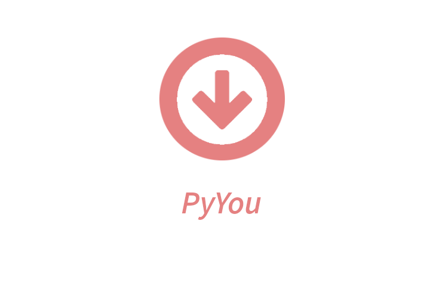

<p align="center">
  
</p>

[](https://www.python.org/)
[](LICENSE)
[]()


## PyYou

PyYou is a desktop application for downloading videos and playlists from YouTube. For writing the program we used python 3.10.5, with the PyTube and tKinter modules. The app was developed in 1 day of work. In the future there will be provable updates, such as 100% graphics support for MacOS and additional features in the app.

## Summary

- Local Installation
- How to use PyYou
- LICENSE
- Contact

## Local Installation

1. Drop a ⭐on the Github repository
2. Clone the repository

```sh
git clone https://github.com/An0n341/PyYou.git
```
4. Create a virtual environment. We recommend creating a virtual environment to keep project dependencies separate.
```sh
python3 -m venv name_environment
```
6. Install all dependencies
```sh
pip install -r requirements.txt
```
7. Run the project
```sh
python app.py
```

## How to use PyYou

PyYou Offers the option to install videos and playlists from YouTube, also allowing you to select whether to install the project in the form of video or audio. Inside the app we have to:
1. Insert a valid YouTube link (video)
2. (optional) Enter a name for the video when downloading
3. Select whether you want to install the video, as video or audio. If it is a playlist we must select the "Playlist" option, by clicking the "Download" button we will be asked how to install the videos of the playlist.
4. Select a valid path for download videos
5. Click download button

## LICENSE

This program is distributed under the license [GNU General Public License](LICENSE), please read the license for information on program distribution and availability.

## Contact

For another projects visited a my personal github profile [](https://www.github.com/An0n341)
